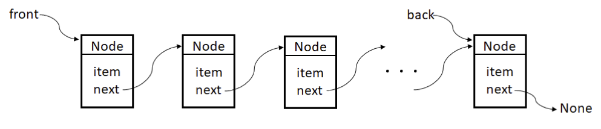
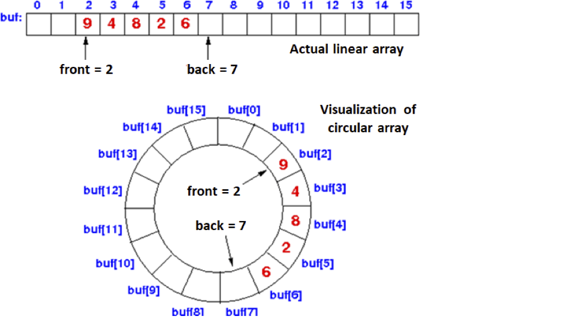

# Lab 3:  Queue Implementations
Goals:
* Implement a Queue class using a link-based data structure:
  queue_linked.py
* Implement a Queue class using a circular array: queue_array.py

Before doing this lab I recommend that you read over section 4.10, 4.11,
and 4.12. You will not be doing the implementation described in section
4.12, but it will help you understand the underlying concepts.

* In the first implementation, you will use a linked structure similar
  to the linked structure used in implementing the Stack ADT
  (i.e. create a Node class).  In this case, there must be a way to add
  items to the back of the list and remove items from the front of the
  list, as illustrated below. 
  

* The second implementation will use a circular array for storing the
  items in the queue.  There are different ways of doing this, but they
  share the idea presented in the picture below.  Items are added to the
  back of the queue using the next “free entry” in an array. Items are
  removed from the front of the queue.  The indices front and back are
  incremented as items are added and deleted from the queue, and the
  indices “wrap around” when they reach the end of the array.  Why is
  using a circular array better than what the text does (i.e. inserting
  new items at index 0 of array, and removing items from the end of the
  array)?
 

For both Queue implementations:

* Attempting to enqueue an item into a full Queue will raise an
  IndexError
* Attempting to dequeue an item from an empty Queue will raise an
  IndexError
* All methods must have O(1) performance (the speed must not be affected
  by the size of the queue)
* As with your stack implementations, you may NOT use any of the
  following Python List operations (we will check!):
* all built-in list methods including:
  * append()
  * `insert()`
  * `extend()`
  * `remove()`
  * `pop()`
* `==` and `!=` between lists
* `del`
* `in`
* `len`
* `+` (concatenation of lists)
* List slicing (e.g. some_list[2:9])

Additional Requirements:
* All queue operations must have O(1) performance
* Your queue implementations must be able to hold values of None as
  valid data

The starter files are linked here; if your class is using GitHub classroom,
get them using the invitation link.

* [queue_array.py](./queue_array.py): Contains an array (Python List) based implementation
  of the Queue class
* [queue_linked.py](./queue_linked.py): Contains a linked based implementation of the Queue
  class
* [queue_tests.py](./queue_tests.py): Contains your set of thorough tests to ensure your
  implementations work correctly. These tests must run correctly on ANY
  implementation that follows the specification.

(Note that the class in each stack implementation is named Queue, and
both implementations must follow the same specification. This allows one
set of tests in queue_tests.py that can be used for both implementations
by just changing which file is used when importing Stack.)
